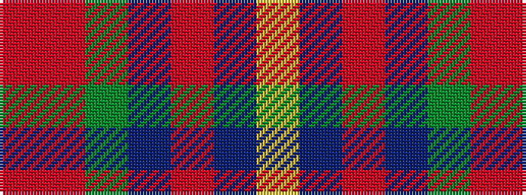

RRGBRBY

It is a 7 stripe tartan.

<figure class="pat-woven">

<figcaption>idealised sample</figcaption>
</figure>

## Colour Sequence



## Tartans with this colour sequence

| Tartans |
|---------------|
| [Highland Prince (Fashion)](/variants/s7/ri32r2g2db30ri1db2ly1~x2/)|
||
