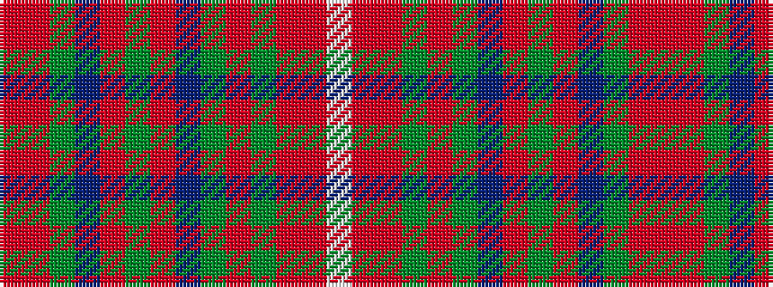

RRGBRGRBGRGRRW

It is a 14 stripe tartan.

<figure class="pat-woven">

<figcaption>idealised sample</figcaption>
</figure>

## Colour Sequence



## Tartans with this colour sequence

| Tartans |
|---------------|
| [MacDonald of Staffa #5](/setts/s14/ri2r4dg2db2r6dg14r2db2dg2r12dg7ri2r5w1~x2/)|
||
| [MacDonald of Staffa 4](/setts/s14/ri2r4g2db2r6g14r2db2g2r12g7ri2r5w1~x2/)|
||
