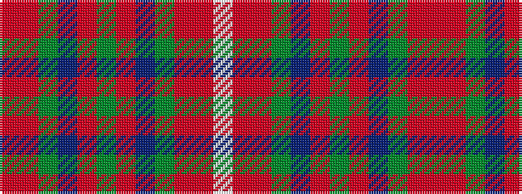

RRGBRGRBGRRW

It is a 12 stripe tartan.

<figure class="pat-woven">

<figcaption>idealised sample</figcaption>
</figure>

## Colour Sequence



## Tartans with this colour sequence

| Tartans |
|---------------|
| [MacKinnon #7](/setts/s12/r3r4dg3dp3r11dg30r3dp7dg3r2r4w2~x2/)|
||
| [MacKinnon 1](/setts/s12/r3r4g3p3r11g30r3p7g3r2r4w2~x2/)|
||
