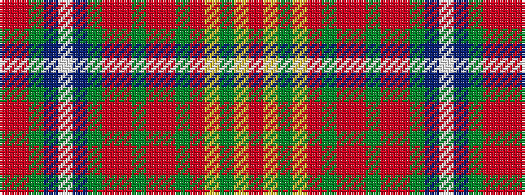

RRGBWBGRRGRRGRYGYR

It is a 18 stripe tartan.

<figure class="pat-woven">

<figcaption>idealised sample</figcaption>
</figure>

## Colour Sequence



## Tartans with this colour sequence

| Tartans |
|---------------|
| [Belk Festive (Fashion)](/variants/s18/ri16r1dg4b2w1b2dg4r1ri1dg41r1ri36g2r3ly1g3ly1r4~x2/)|
||
