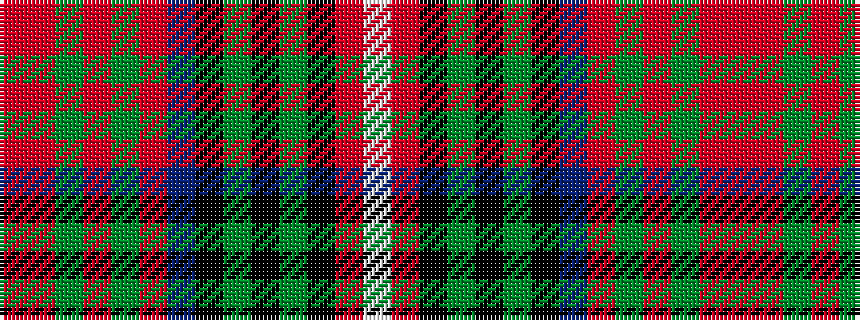

RRGRGRBKGKGKRW

It is a 14 stripe tartan.

<figure class="pat-woven">

<figcaption>idealised sample</figcaption>
</figure>

## Colour Sequence



## Tartans with this colour sequence

| Tartans |
|---------------|
| [Berwick-upon-Tweed (symmetric)](/setts/s14/ri9r5dg2r4dg2r5n38k5dg2k4dg2k5ri8lb4~x2/)|
||
