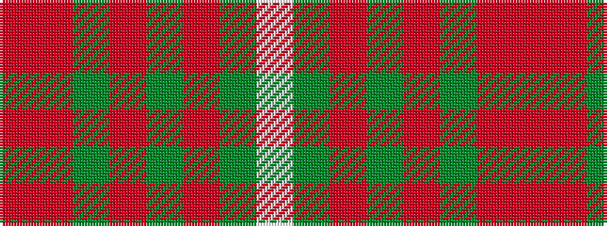

RRGRGRGW

It is a 8 stripe tartan.

<figure class="pat-woven">

<figcaption>idealised sample</figcaption>
</figure>

## Colour Sequence



## Tartans with this colour sequence

| Tartans |
|---------------|
| [Connacht #2](/variants/s8/r1o1dg6o15dy2o1dy6w1~x4/)|
||
