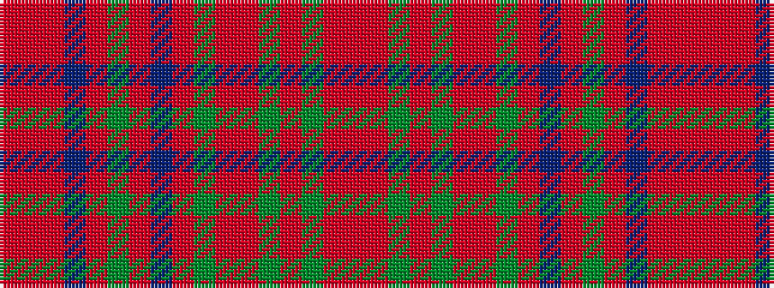

RRGRGRRGRBRGRBRRR

It is a 17 stripe tartan.

<figure class="pat-woven">

<figcaption>idealised sample</figcaption>
</figure>

## Colour Sequence



## Tartans with this colour sequence

| Tartans |
|---------------|
| [MacColl, Ancient](/setts/s17/r7ri3r6db26r8dg2r2db2r2g1ri2r8g26r8g2r2ri2~x2/)|
||
