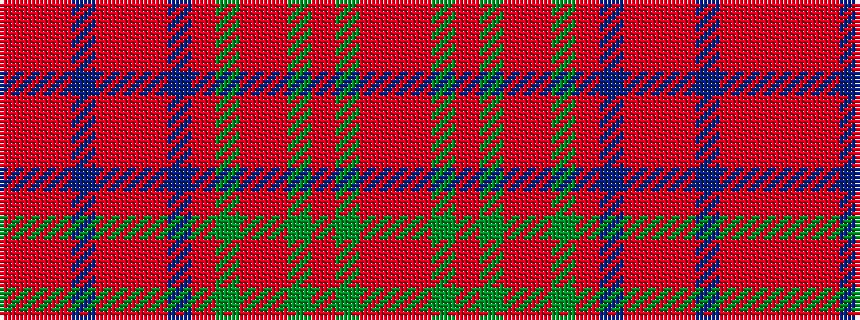

RRGRGRRGRBRRRBRRR

It is a 17 stripe tartan.

<figure class="pat-woven">

<figcaption>idealised sample</figcaption>
</figure>

## Colour Sequence



## Tartans with this colour sequence

| Tartans |
|---------------|
| [MacColl Ancient](/setts/s17/r7r3r6db26r8r2r2db2r2dg1r2r8dg26r8dg2r2r2~x2/)|
||
