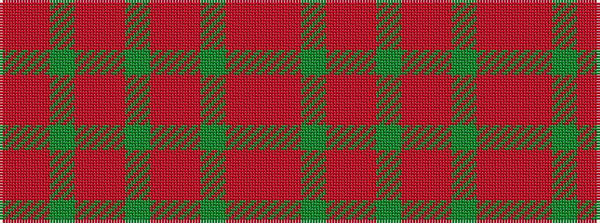

RRGRRGRRGRR

It is a 11 stripe tartan.

<figure class="pat-woven">

<figcaption>idealised sample</figcaption>
</figure>

## Colour Sequence



## Tartans with this colour sequence

| Tartans |
|---------------|
| [Unnamed Green (Teddy Bear)](/setts/s11/r1o3g2o3r1g24r1o3g2o3r1~x2/)|
||
