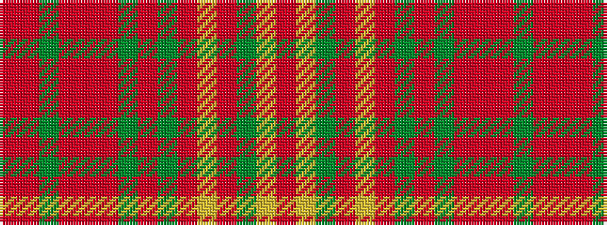

RRGRRRGRGRYRGYR

It is a 15 stripe tartan.

<figure class="pat-woven">

<figcaption>idealised sample</figcaption>
</figure>

## Colour Sequence



## Tartans with this colour sequence

| Tartans |
|---------------|
| [Howell of Wales](/setts/s15/o8r1dg3o5r1o5dg3o4dg12o14ly1o14dg12ly2r3~x2/)|
||
