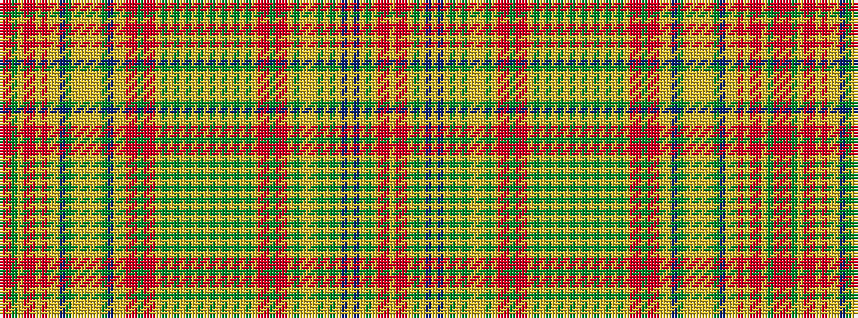

RRGYRRYRYYBGYYYYYGBYYRRGRRYGYGYGYGYGYGYGYGYRRGRRYGYYYGYGYBYBYGYRRY

It is a 66 stripe tartan.

<figure class="pat-woven">

<figcaption>idealised sample</figcaption>
</figure>

## Colour Sequence



## Tartans with this colour sequence

| Tartans |
|---------------|
| [Hunter Portrait/Artefact Tartan Tartan Number: 5873. Earliest known date: 1775 Presented to the Tartans Authority in Canada in 2003 by a Jean Hunter from Huntsville Ontario who had been given it by her Father the Rev. George W. Hunter - a minister in Aberdeen. The piece is a shawl 6ft 6inches long by 19inches wide and is what is known as a hard, superfine tartan using typical Wilson of Bannockburn colours. The sett is selvedge to selvedge full repeat and the weave is 52epi. The sett is complex with 8 colours and 67 colour changes. Embroidered into the end of the shawl is "Donnald 1775" See products available Copyright © Blair Urquhart, Comrie, 2015](/setts/s66/r30ri4y6lo4ri4r16lr2ri4lr2lo4db18y6ly3lr2lo4lr2ly3y6db18lo4lr2ri4r12y2r12ri3lr2g10lr2g2ly4g2lr2y8lr4y8lr2g2ly4g2lr2g10lr2ri4r12y2r12ri4lr2g10lo4lr4lo4g10lr2y6lr2db12lr2db12lr2y6lr2ri4r12lr2~x2/)|
|![Hunter Portrait/Artefact Tartan Tartan Number: 5873. Earliest known date: 1775 Presented to the Tartans Authority in Canada in 2003 by a Jean Hunter from Huntsville Ontario who had been given it by her Father the Rev. George W. Hunter - a minister in Aberdeen. The piece is a shawl 6ft 6inches long by 19inches wide and is what is known as a hard, superfine tartan using typical Wilson of Bannockburn colours. The sett is selvedge to selvedge full repeat and the weave is 52epi. The sett is complex with 8 colours and 67 colour changes. Embroidered into the end of the shawl is "Donnald 1775" See products available Copyright © Blair Urquhart, Comrie, 2015 example sett](/setts/s66/r30ri4y6lo4ri4r16lr2ri4lr2lo4db18y6ly3lr2lo4lr2ly3y6db18lo4lr2ri4r12y2r12ri3lr2g10lr2g2ly4g2lr2y8lr4y8lr2g2ly4g2lr2g10lr2ri4r12y2r12ri4lr2g10lo4lr4lo4g10lr2y6lr2db12lr2db12lr2y6lr2ri4r12lr2~x2/sett.png)|
