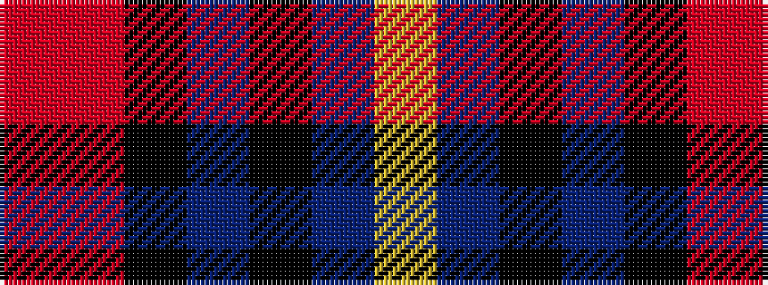

RRKBKBY

It is a 7 stripe tartan.

<figure class="pat-woven">

<figcaption>idealised sample</figcaption>
</figure>

## Colour Sequence



## Tartans with this colour sequence

| Tartans |
|---------------|
| [Lopez-Gasparotto](/variants/s7/r1o5k5db1k1db6ly1~x8/)|
||
