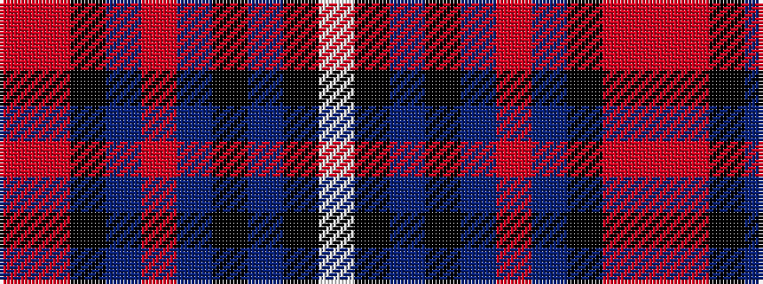

RRKBRBKBKW

It is a 10 stripe tartan.

<figure class="pat-woven">

<figcaption>idealised sample</figcaption>
</figure>

## Colour Sequence



## Tartans with this colour sequence

| Tartans |
|---------------|
| [Fitzgerald Hunting](/setts/s10/r2m3k16db4r2db4k36n3k3w2~x2/)|
||
