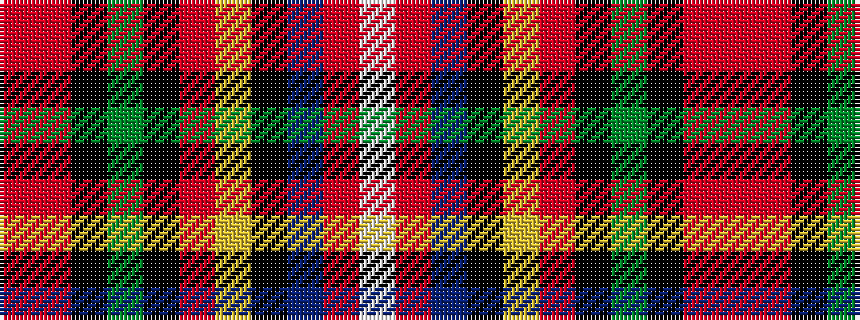

RRKGKRYKBRW

It is a 11 stripe tartan.

<figure class="pat-woven">

<figcaption>idealised sample</figcaption>
</figure>

## Colour Sequence



## Tartans with this colour sequence

| Tartans |
|---------------|
| [Colville (Personal)](/variants/s11/r16m3k12dy10k3r3ly3k3db2r2w1~x2/)|
||
