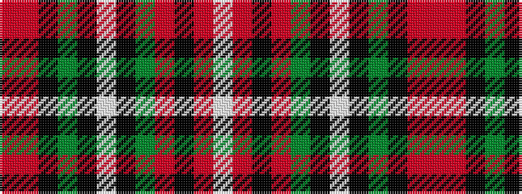

RRKGKWKGRKRW

It is a 12 stripe tartan.

<figure class="pat-woven">

<figcaption>idealised sample</figcaption>
</figure>

## Colour Sequence



## Tartans with this colour sequence

| Tartans |
|---------------|
| [British Caledonian Airways #4](/setts/s12/r68o5k9y3k3lb3k3dg20r9k3r5lb4/)|
||
