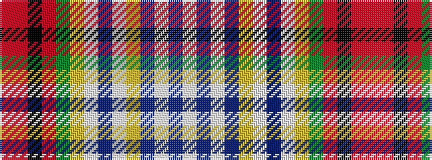

RRKRGYWBWYBWBW

It is a 14 stripe tartan.

<figure class="pat-woven">

<figcaption>idealised sample</figcaption>
</figure>

## Colour Sequence



## Tartans with this colour sequence

| Tartans |
|---------------|
| [Dundee](/variants/s14/r42ri2k15ri2dg22ly4w2dp2w2ly4t7w2dp6w6~x2/)|
||
| [Dundee](/variants/s14/ri42r2k15r2g22ly4w2p2w2ly4t7w2p6w6~x2/)|
||
| [Dundee (1819) (District)](/variants/s14/r42ri2k15ri2g22ly4w2dp2w2ly4t7w2dp6w6~x2/)|
||
