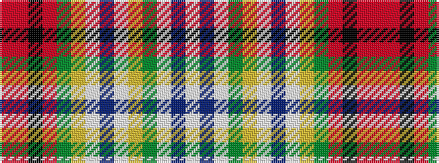

RRKRGYWBWYGWBW

It is a 14 stripe tartan.

<figure class="pat-woven">

<figcaption>idealised sample</figcaption>
</figure>

## Colour Sequence



## Tartans with this colour sequence

| Tartans |
|---------------|
| [Dundee #3](/setts/s14/r42m2k15m2dg22ly4lb2dp2lb2ly4y7lb2dp6lb6~x2/)|
||
