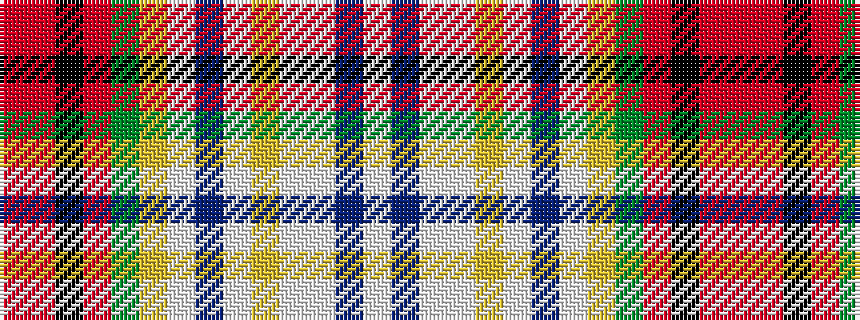

RRKRGYWBWYWWBW

It is a 14 stripe tartan.

<figure class="pat-woven">

<figcaption>idealised sample</figcaption>
</figure>

## Colour Sequence



## Tartans with this colour sequence

| Tartans |
|---------------|
| [Dundee Pink Variation](/variants/s14/m42r2k15r2dg22lo4lb2dp2lb2lo4lbi7lb2dp6lb6~x2/)|
||
