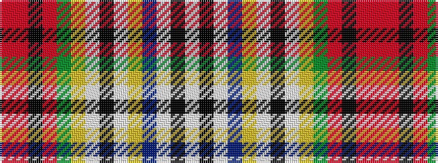

RRKRGYWKWYBWKW

It is a 14 stripe tartan.

<figure class="pat-woven">

<figcaption>idealised sample</figcaption>
</figure>

## Colour Sequence



## Tartans with this colour sequence

| Tartans |
|---------------|
| [Dundee](/setts/s14/ri30r2k6r2g17ly7w2k2w2ly4t7w2k6w6~x2/)|
||
| [Dundee #2](/setts/s14/r30ri2k6ri2dg17ly7w2k2w2ly4t7w2k6w6~x2/)|
||
| [Dundee District Tartan Tartan Number: 1645. Earliest known date: 1819 The design of the Dundee sett is very similar to that of a tartan jacket said to have been worn by Bonnie Prince Charlie at the Battle of Culloden in 1746, now preserved in the Scottish United Services Museum in Edinburgh Castle. This version is known as Dundee New Colours referring to the change of the black stripe from the original purple. See products available Copyright © Blair Urquhart, Comrie, 2015](/setts/s14/r30ri2k6ri2g17ly7w2k2w2ly4t7w2k6w6~x2/)|
||
