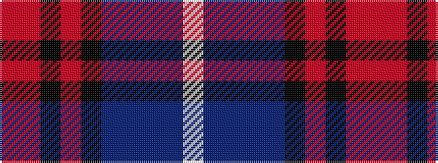

RRKRKBBBBW

It is a 10 stripe tartan.

<figure class="pat-woven">

<figcaption>idealised sample</figcaption>
</figure>

## Colour Sequence



## Tartans with this colour sequence

| Tartans |
|---------------|
| [Bell Rock Lighthouse 200th Anniversary, The](/setts/s10/w6n8db4n2db31k16r1k2r4r3~x2/)|
||
