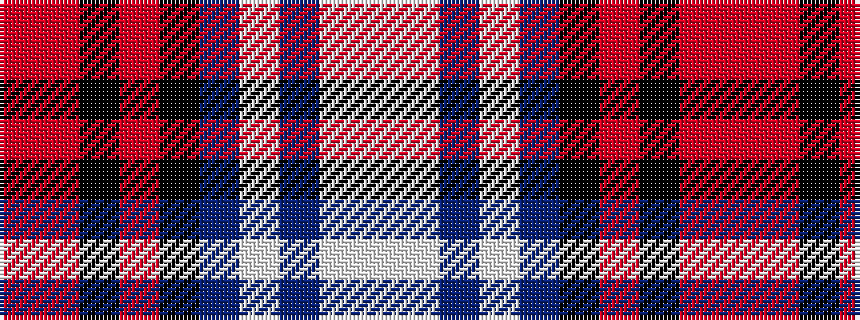

RRKRKBWBWW

It is a 10 stripe tartan.

<figure class="pat-woven">

<figcaption>idealised sample</figcaption>
</figure>

## Colour Sequence



## Tartans with this colour sequence

| Tartans |
|---------------|
| [Bell Rock Lighthouse 200th Aniversar](/variants/s10/w5lb7db4lb2db25k13ri1k2ri4r3~x2/)|
||
