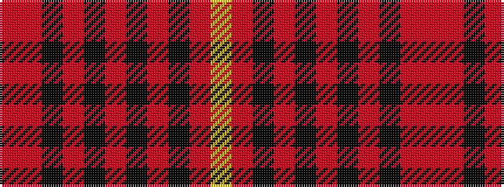

RRKRKRKRKRY

It is a 11 stripe tartan.

<figure class="pat-woven">

<figcaption>idealised sample</figcaption>
</figure>

## Colour Sequence



## Tartans with this colour sequence

| Tartans |
|---------------|
| [Wcwm 1713](/setts/s11/r3o26k12o3k16o4k16o3k12o26ly3~x2/)|
||
