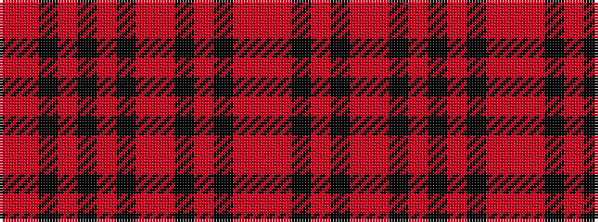

RRKRKRKRRKRKRR

It is a 14 stripe tartan.

<figure class="pat-woven">

<figcaption>idealised sample</figcaption>
</figure>

## Colour Sequence



## Tartans with this colour sequence

| Tartans |
|---------------|
| [Old Aberdeen Diamond Jubilee](/setts/s14/r3r2k7r3k3r52r4k52r3k3r3k7r2r3/)|
||
