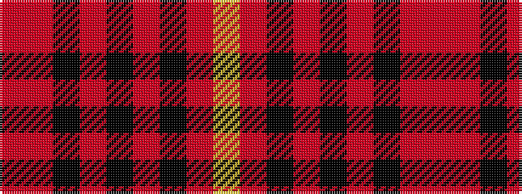

RRKRKRKRY

It is a 9 stripe tartan.

<figure class="pat-woven">

<figcaption>idealised sample</figcaption>
</figure>

## Colour Sequence



## Tartans with this colour sequence

| Tartans |
|---------------|
| [Mowdowny (Fashion)](/variants/s9/r1o6k1o1k2o1k1o6lo1~x8/)|
||
