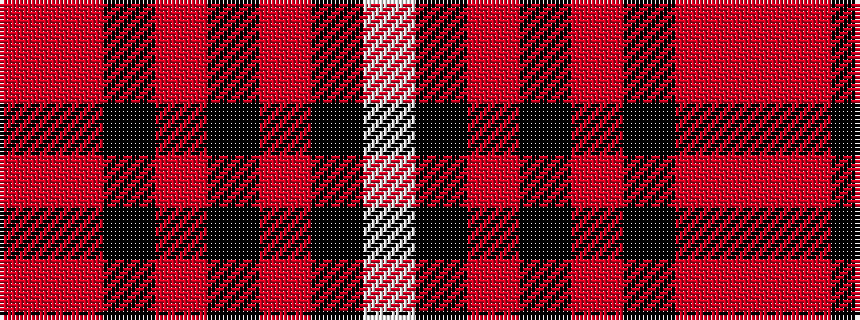

RRKRKRKW

It is a 8 stripe tartan.

<figure class="pat-woven">

<figcaption>idealised sample</figcaption>
</figure>

## Colour Sequence



## Tartans with this colour sequence

| Tartans |
|---------------|
| [Sreijsener (Name)](/setts/s8/r8m12k6m33k72o6k8w6/)|
||
