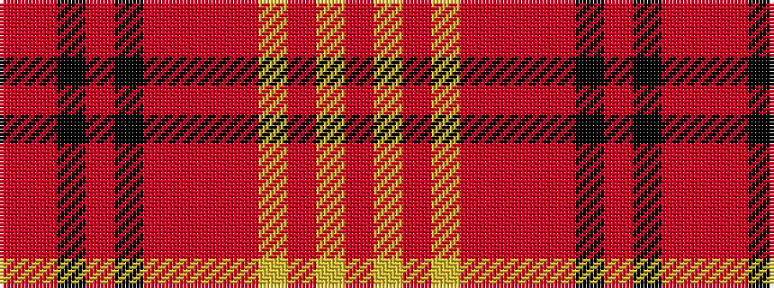

RRKRKRRRRYRYR

It is a 13 stripe tartan.

<figure class="pat-woven">

<figcaption>idealised sample</figcaption>
</figure>

## Colour Sequence



## Tartans with this colour sequence

| Tartans |
|---------------|
| [Princess Mary (Royal)](/variants/s13/r24r2k2r3k1r1r1r1r4lr2r1lr2r1~x4/)|
||
