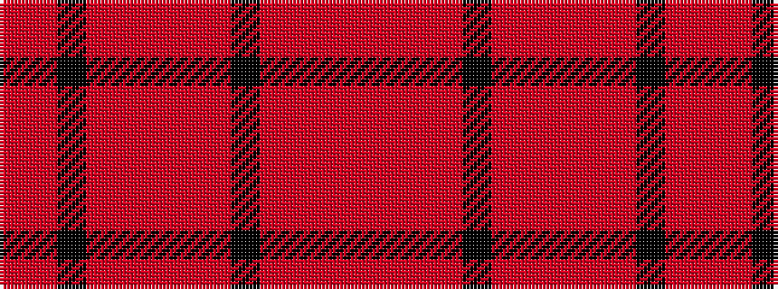

RRKRRRRRKRRRR

It is a 13 stripe tartan.

<figure class="pat-woven">

<figcaption>idealised sample</figcaption>
</figure>

## Colour Sequence



## Tartans with this colour sequence

| Tartans |
|---------------|
| [Balmoral (Lavender) (Royal)](/variants/s13/o2r1o8m2k2o1m1o1m4o2k1o1r1~x4/)|
||
