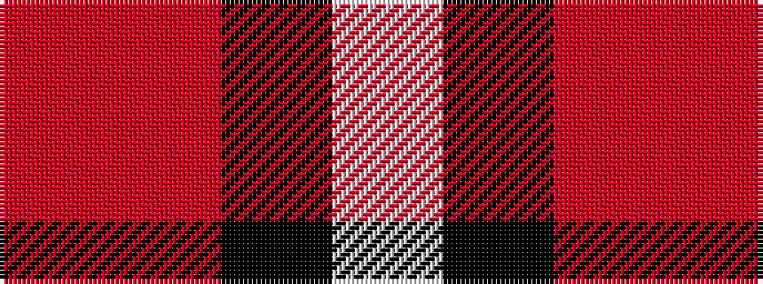

RRKW

It is a 4 stripe tartan.

<figure class="pat-woven">

<figcaption>idealised sample</figcaption>
</figure>

## Colour Sequence



## Tartans with this colour sequence

| Tartans |
|---------------|
| [Loganair](/setts/r5o32k31w5/)|
||
| [Thompson, Dress (Clan)](/variants/s4/r3o16k16lb3~x4/)|
||
