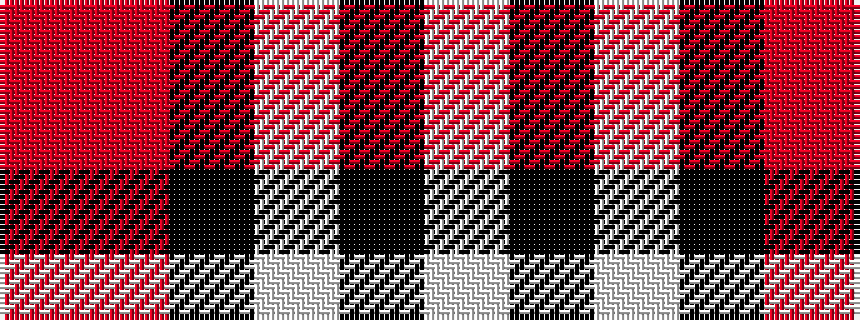

RRKWKW

It is a 6 stripe tartan.

<figure class="pat-woven">

<figcaption>idealised sample</figcaption>
</figure>

## Colour Sequence



## Tartans with this colour sequence

| Tartans |
|---------------|
| [Thom(p)son camel](/variants/s6/r4o30k6w13k13w3~x2/)|
||
| [Tiree Grey](/variants/s6/lb3k3lb3k3o15r1~x4/)|
||
