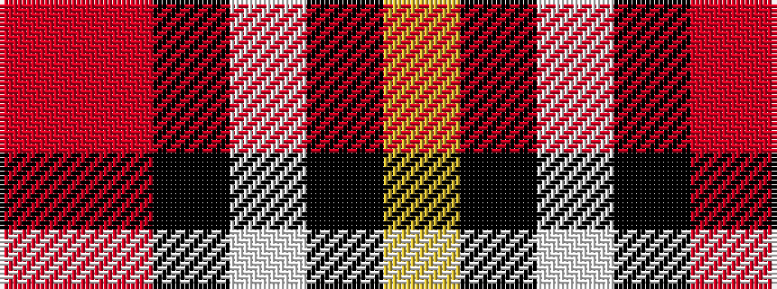

RRKWKY

It is a 6 stripe tartan.

<figure class="pat-woven">

<figcaption>idealised sample</figcaption>
</figure>

## Colour Sequence



## Tartans with this colour sequence

| Tartans |
|---------------|
| [Thomson Dress (Grey) (Fashion)](/variants/s6/r4o25k6w12k11ly3~x2/)|
||
