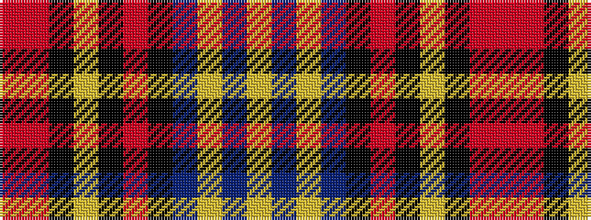

RRKYKRKBYBY

It is a 11 stripe tartan.

<figure class="pat-woven">

<figcaption>idealised sample</figcaption>
</figure>

## Colour Sequence



## Tartans with this colour sequence

| Tartans |
|---------------|
| [Kerry (WCWM)](/setts/s11/lr24b3lr8b5k3o3k3lr3k3m24o4~x2/)|
||
