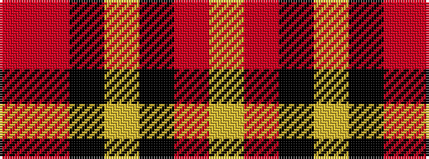

RRKYKRY

It is a 7 stripe tartan.

<figure class="pat-woven">

<figcaption>idealised sample</figcaption>
</figure>

## Colour Sequence



## Tartans with this colour sequence

| Tartans |
|---------------|
| [Duffus, Lord](/variants/s7/ly15r7k12ly12k12o12r7~x2/)|
||
