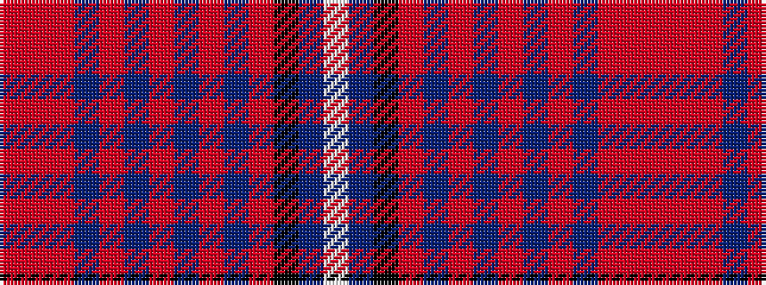

RRRBRBRBRBRKBW

It is a 14 stripe tartan.

<figure class="pat-woven">

<figcaption>idealised sample</figcaption>
</figure>

## Colour Sequence



## Tartans with this colour sequence

| Tartans |
|---------------|
| [New Jersey](/setts/s14/o4r2o24db2o1db2o4db2o1db2o8k1db16w4~x2/)|
||
