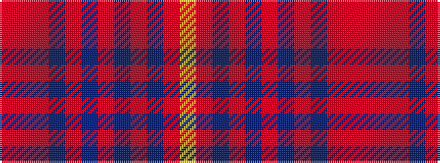

RRRBRBRBRBRY

It is a 12 stripe tartan.

<figure class="pat-woven">

<figcaption>idealised sample</figcaption>
</figure>

## Colour Sequence



## Tartans with this colour sequence

| Tartans |
|---------------|
| [Cutter (Name)](/setts/s12/r2r2r14db2r2db5r2db2r2db12r1ly1~x4/)|
||
