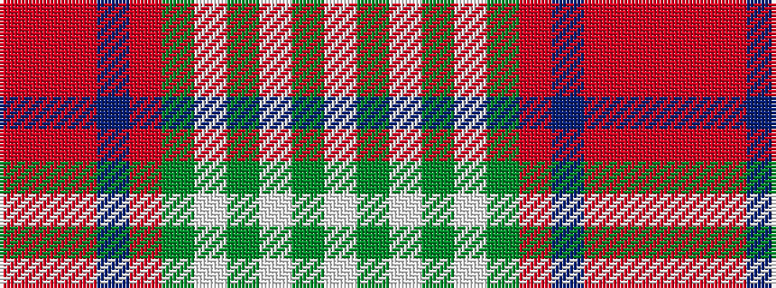

RRRBRGWGWGW

It is a 11 stripe tartan.

<figure class="pat-woven">

<figcaption>idealised sample</figcaption>
</figure>

## Colour Sequence



## Tartans with this colour sequence

| Tartans |
|---------------|
| [Isle of Skye (District)](/variants/s11/lb24dg3lb3dg3lb3dg10o12dp12o12o2o3~x2/)|
||
