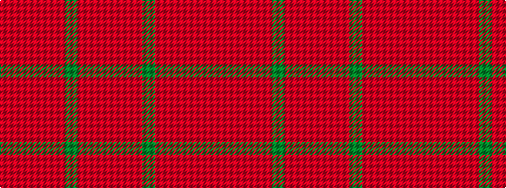

RRRGRRRRR

It is a 9 stripe tartan.

<figure class="pat-woven">

<figcaption>idealised sample</figcaption>
</figure>

## Colour Sequence



## Tartans with this colour sequence

| Tartans |
|---------------|
| [Valdres, Kvam & Vang](/setts/s9/r4ri2r1dg16ri2r11ri1r1ri2~x2/)|
||
| [Valdres, Kvam & Vang (Artefact)](/setts/s9/r5ri2r1g16ri2r11ri1r1ri2~x4/)|
||
