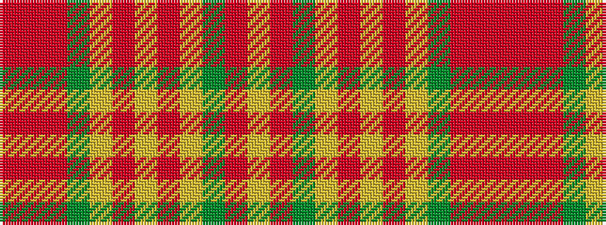

RRRGYRYRYGRY

It is a 12 stripe tartan.

<figure class="pat-woven">

<figcaption>idealised sample</figcaption>
</figure>

## Colour Sequence



## Tartans with this colour sequence

| Tartans |
|---------------|
| [Pierce](/variants/s12/o6r4o24dg14lo9o3lo3o3lo9dg24o9lo6~x2/)|
||
