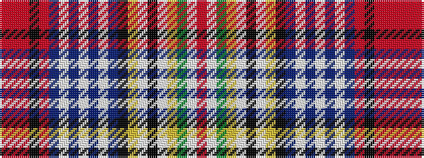

RRRKRBWBWBWBKYWKWYGWR

It is a 21 stripe tartan.

<figure class="pat-woven">

<figcaption>idealised sample</figcaption>
</figure>

## Colour Sequence



## Tartans with this colour sequence

| Tartans |
|---------------|
| [Dundee Wallace](/variants/s21/r52w2g43ly4w2k2w2ly4k18t8w2dp8w8dp8w2t8r10k3m2ri2r4~x2/)|
||
| [Dundee Wallace Family Tartan](/variants/s21/ri52w2g43ly4w2k2w2ly4k18t8w2dp8w8dp8w2t8ri10k3rii2r2ri4~x2/)|
||
| [Dundee, Wallace](/variants/s21/rii52w2g43ly4w2k2w2ly4k18t8w2p8w8p8w2t8rii10k3r2ri2rii4~x2/)|
||
