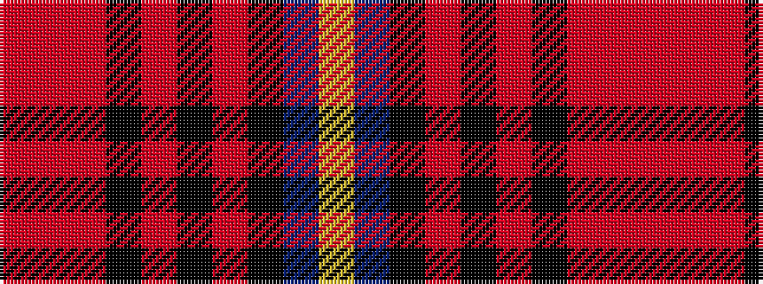

RRRKRKRKBY

It is a 10 stripe tartan.

<figure class="pat-woven">

<figcaption>idealised sample</figcaption>
</figure>

## Colour Sequence



## Tartans with this colour sequence

| Tartans |
|---------------|
| [Brady 60th (Personal)](/variants/s10/o1r1o7k3o1k1o1k1db9ly1~x4/)|
||
