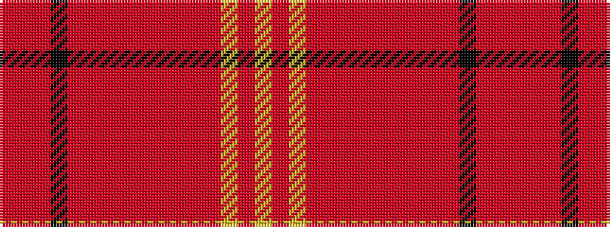

RRRKRRRRRRRRRYRY

It is a 16 stripe tartan.

<figure class="pat-woven">

<figcaption>idealised sample</figcaption>
</figure>

## Colour Sequence



## Tartans with this colour sequence

| Tartans |
|---------------|
| [Brian Boru 1014 (Commemorative)](/setts/s16/r4o2r24k1o8r2o1r2o4r2o1r2o16ly2o1ly4~x2/)|
||
