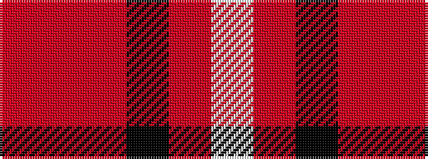

RRRKRW

It is a 6 stripe tartan.

<figure class="pat-woven">

<figcaption>idealised sample</figcaption>
</figure>

## Colour Sequence



## Tartans with this colour sequence

| Tartans |
|---------------|
| [Wcwm 759-2](/setts/s6/lb5r34k22r4o24r4~x2/)|
||
| [Wcwm 759-3](/setts/s6/lb5o34k24o4r24o4~x2/)|
||
