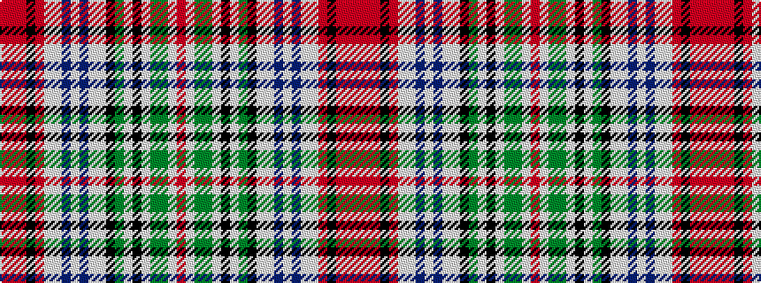

RRRKRWWBWBWWKGWKWGGWR

It is a 21 stripe tartan.

<figure class="pat-woven">

<figcaption>idealised sample</figcaption>
</figure>

## Colour Sequence



## Tartans with this colour sequence

This pattern is a design lineage: every tartan below shares one colour order, whatever its owner —
near-identical designs are grouped, the largest lineage first (#112: the pattern is a tartan's
second parent, beside its family or clan).

<table class="sett-table">
<tbody>
<tr><td><a href="/variants/s21/ri52w2g43y4w2k2w2y4k18lb8w2dp8w8dp8w2lb8ri10k3r2rii2ri4~x2~ri2109032-r1807008-rii2806019/">Dundee Wallace</a></td></tr>
<tr><td class="sett-swatch"></td></tr>
<tr class="cluster-sep"><td></td></tr>
<tr><td><a href="/variants/s21/ri52w2g43y4w2k2w2y4k18lb8w2dp8w8dp8w2lb8ri10k3rii2r2ri4~x2~ri2109032-rii2406019-r2108022/">Dundee Wallace Family Tartan</a></td></tr>
<tr><td class="sett-swatch"></td></tr>
</tbody>
</table>

