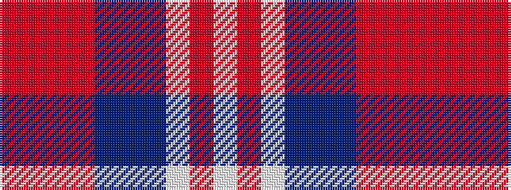

RRRRBBBWRW

It is a 10 stripe tartan.

<figure class="pat-woven">

<figcaption>idealised sample</figcaption>
</figure>

## Colour Sequence



## Tartans with this colour sequence

| Tartans |
|---------------|
| [Outpost Club](/variants/s10/lb6r5lb9db2b3db2o36r2o4r2~x2/)|
||
