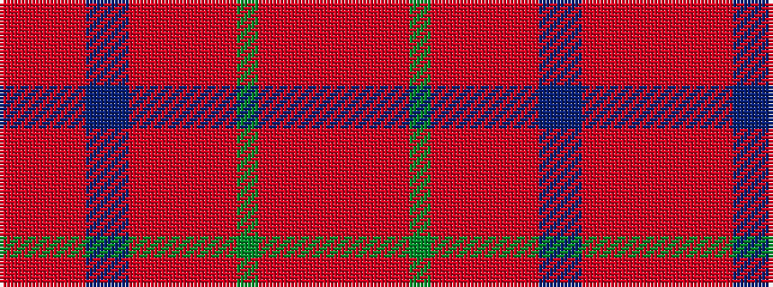

RRRRBBRRRRRGRRRR

It is a 16 stripe tartan.

<figure class="pat-woven">

<figcaption>idealised sample</figcaption>
</figure>

## Colour Sequence



## Tartans with this colour sequence

| Tartans |
|---------------|
| [MacDougall #9](/variants/s16/r6rii4ri2r3dg34rii3ri2r4ri2rii3dp8t2r40rii4ri2r6~x2/)|
||
| [MacDougall 4](/variants/s16/ri6rii4r2ri3g34rii3r2ri4r2rii3p8t2ri40rii4r2ri6~x2/)|
||
