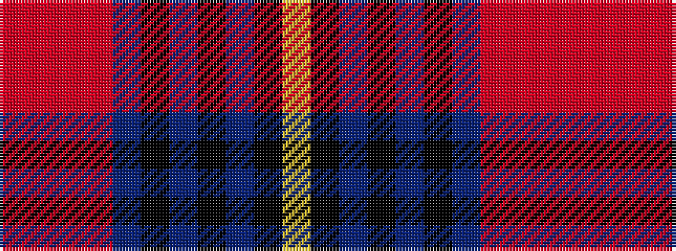

RRRRBKBKBKY

It is a 11 stripe tartan.

<figure class="pat-woven">

<figcaption>idealised sample</figcaption>
</figure>

## Colour Sequence



## Tartans with this colour sequence

| Tartans |
|---------------|
| [Dryburgh](/setts/s11/o2o2o2o16n10k3n2k2n2k10ly2~x2/)|
||
