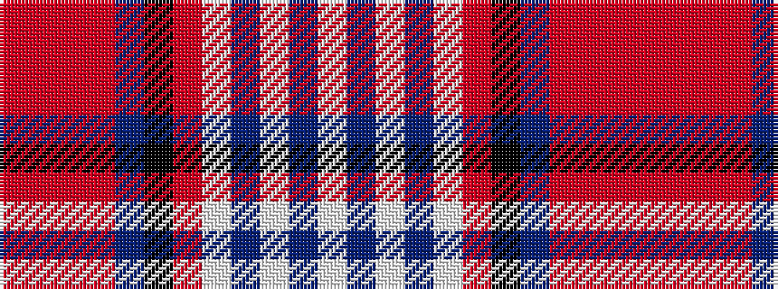

RRRRBKRWBWBW

It is a 12 stripe tartan.

<figure class="pat-woven">

<figcaption>idealised sample</figcaption>
</figure>

## Colour Sequence



## Tartans with this colour sequence

| Tartans |
|---------------|
| [Canfor (Corporate)](/variants/s12/r62ri1r6ri9n2k2ri9lb6n1lb6n20lb2~x2/)|
||
