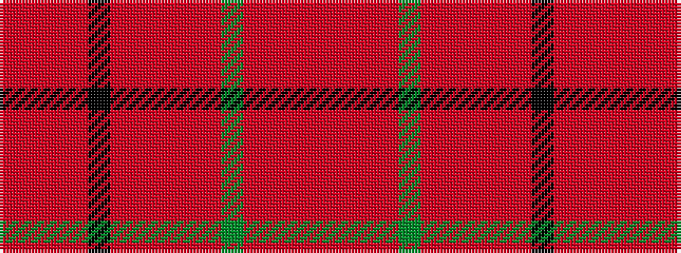

RRRRGRRRRRKRRRR

It is a 15 stripe tartan.

<figure class="pat-woven">

<figcaption>idealised sample</figcaption>
</figure>

## Colour Sequence



## Tartans with this colour sequence

| Tartans |
|---------------|
| [MacDougall (Kinloch Anderson)](/variants/s15/r7ri5rii5r31k9rii4ri3r5ri3rii4dg30r4ri3rii5r5~x2/)|
||
| [MacDougall 3](/variants/s15/ri7r5rii5ri31k9rii4r3ri5r3rii4g30ri4r3rii5ri5~x2/)|
||
