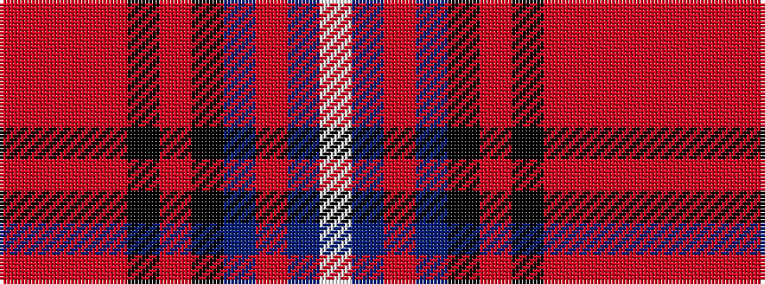

RRRRKRKBRBW

It is a 11 stripe tartan.

<figure class="pat-woven">

<figcaption>idealised sample</figcaption>
</figure>

## Colour Sequence



## Tartans with this colour sequence

| Tartans |
|---------------|
| [IRPA (Corporate)](/variants/s11/r6o2r2o23k2r4k2t21r2t2w6~x2/)|
||
