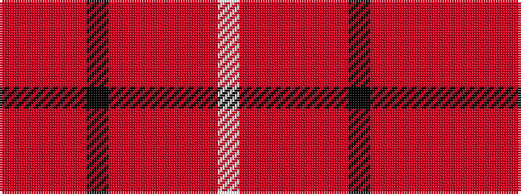

RRRRKRRRRRW

It is a 11 stripe tartan.

<figure class="pat-woven">

<figcaption>idealised sample</figcaption>
</figure>

## Colour Sequence



## Tartans with this colour sequence

| Tartans |
|---------------|
| [Frater](/setts/s11/o6ri2r15o15k2o15ri2r6ri2o8w2~x2/)|
||
| [Frater (Name)](/setts/s11/o6ri2r15o15k2o15ri2r6ri2o8lb2~x2/)|
||
