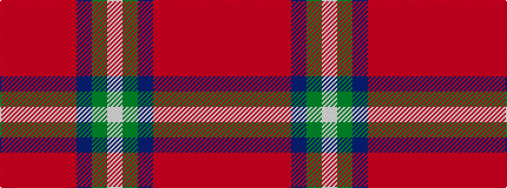

RRRRRBGW

It is a 8 stripe tartan.

<figure class="pat-woven">

<figcaption>idealised sample</figcaption>
</figure>

## Colour Sequence



## Tartans with this colour sequence

| Tartans |
|---------------|
| [Akins Clan (Personal)](/variants/s8/ri21r3ri3r3ri3db19g22lt3~x2/)|
||
